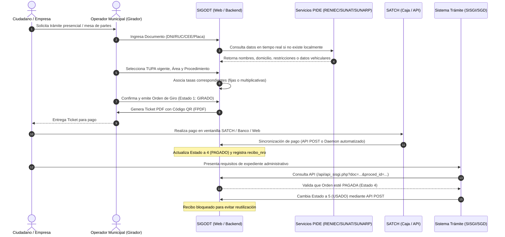

# Volumen 1: Funcionalidad y Flujo de Negocio
**Sistema Integrado de Gestión de Órdenes de Derecho de Trámite (SIGODT)**  
**Municipalidad Provincial de Chiclayo (MPCH)**  

---

## 🎯 1. ¿Qué es y qué realiza SIGODT?

El **SIGODT** es la plataforma informática misional encargada de la **liquidación, emisión, control, seguimiento y validación de cobro de los derechos de trámite administrativo y tasas municipales** de la Municipalidad Provincial de Chiclayo.

En el ámbito de la administración pública peruana (regido por la Ley Nº 27972 - Ley Orgánica de Municipalidades y el TUO de la Ley Nº 27444 - Ley del Procedimiento Administrativo General), cualquier persona o empresa que desee iniciar un trámite (como una licencia de funcionamiento, inspección técnica ITSE, autorización de transporte, certificado de numeración, partida registral, etc.) debe pagar previamente la tasa estipulada en el **TUPA** (Texto Único de Procedimientos Administrativos).

Históricamente, los municipios emitían recibos manuales o liquidaciones desconectadas de los sistemas de caja y trámite documental, generando:
- Pérdida de recaudación por falsificación de recibos o doble uso del mismo comprobante.
- Incompatibilidad entre el trámite solicitado y la tasa cobrada.
- Tiempos muertos de atención al ciudadano en colas de verificación.

**SIGODT resuelve esto centralizando la emisión de una Orden de Giro electrónica única** (`ogciud_id`), enlazada en tiempo real con las entidades de identidad nacional (RENIEC, SUNAT, Migraciones) y con el ente recaudador local (**SATCH** - Servicio de Administración Tributaria de Chiclayo).

---

## 🔄 2. El Ciclo de Vida de una Orden de Giro

Una Orden de Giro en SIGODT transita por un ciclo de vida estrictamente auditado a través de los siguientes pasos:

---

## 🏷️ 3. Máquina de Estados de la Orden de Giro

Tanto las tablas `sc_giros.td_ordengirociud` (orden de giro), `sc_giros.td_tasatciud` (tasa individual) y `sc_giros.td_procedciudadano` (expediente/trámite) se rigen por un código numérico estandarizado de estados:

| Código | Denominación | Significado Operativo en el Negocio |
| :---: | :--- | :--- |
| **0** | **ANULADO** | La orden fue desestimada o cancelada por el operador antes de su pago, o anulada administrativamente. |
| **1** | **GIRADO (Pendiente)** | La orden ha sido generada por el funcionario municipal y cuenta con código correlativo (`000000-AAAA`), pero aún no ha sido pagada en el SATCH. |
| **2** | **GIRADO (Asignado)** | En ciertos subprocesos de liquidación o giros agrupados, indica que las tasas están listas para pago en caja. |
| **3** | **IMPROCEDENTE** | Se detectó incompatibilidad legal, caducidad del trámite, o el administrado presenta restricciones formales (fallecimiento, DNI cancelado, etc.). |
| **4** | **PAGADO** | El SATCH o la caja municipal ha registrado el ingreso dinerario efectivo y asignado un número de recibo oficial (`recibo_nro`). |
| **5** | **USADO** | El administrado ha presentado su comprobante ante Mesa de Partes o en el Sistema de Gestión Documental (SGD/SISGI), aperturando formalmente el expediente. **Queda imposibilitado de reutilización.** |
| **6** | **EXTORNADO** | Ocurrió una devolución formal de dinero o reversión contable por pago indebido o error en caja. El recibo queda invalidado. |

---

## 👥 4. Tipos de Administrados Gestionados

SIGODT categoriza a los solicitantes en tres naturalezas jurídicas con reglas de negocio particulares:

### A. Persona Natural
- **Documentos aceptados:**
  - **DNI (Código 1):** Obliga a validación vía RENIEC y MINSA. Si el administrado figura como menor de edad, el sistema permite registrar datos de contacto pero advierte restricciones.
  - **Carnet de Extranjería / CEE (Código 3):** Valida contra el padrón de la Superintendencia Nacional de Migraciones.
  - **Carné de Permiso Temporal de Permanencia / CPP (Código 4):** Valida a ciudadanos extranjeros en proceso de regularización migratoria en Perú.
- **Datos requeridos:** Nombres, apellido paterno, apellido materno, sexo, fecha de nacimiento, domicilio real y fotografía (cuando PIDE la suministra).

### B. Persona Jurídica (Empresas)
- **Documento:** RUC de 11 dígitos (con prefijos válidos 20, 10, 15, 17).
- **Validación:** Consulta en línea con la base de datos de SUNAT.
- **Datos requeridos:** Razón social, nombre comercial, condición (Habido / No Habido), estado del contribuyente (Activo / Baja), domicilio fiscal y Clasificación Industrial Internacional Uniforme (CIIU / Giro del negocio).
- **Asociación obligatoria:** Todo trámite empresarial en ventanilla debe consignar además los datos del representante o apoderado legal (persona natural con DNI).

### C. Trámites de Tránsito y Vehículos (Transporte Público / Flotas)
- **Documento identificador:** Placa de rodaje vehicular.
- **Validación:** Consulta contra SUNARP (Superintendencia Nacional de los Registros Públicos) y la base interna municipal `sc_transito_transporte`.
- **Datos requeridos:** Número de motor, número de chasis (VIN), marca, modelo, año de fabricación, tipo de carrocería, propietarios registrales y empresa/concesionaria a la que pertenece la flota.
- **Funcionalidad especial:** Emisión de giros agrupados para empresas de transportes que liquidan inspecciones técnicas o habilitaciones para múltiples vehículos en un solo procedimiento.

---

## 🏛️ 5. Estructura del TUPA y Procedimientos Municipales

El sistema almacena y gestiona la estructura normativa mediante un modelo en cascada:

1. **TUPA (`sc_giros.tm_tupa`):** Representa el instrumento de gestión municipal aprobado por ordenanza. Admite control de versiones por año (`tupa_año`), estado activo/inactivo, bloqueo de edición y función de duplicación masiva (`duplicar_tupa`) para cuando se promulga un nuevo TUPA.
2. **Dependencia / Área (`public.tb_dependencia`):** Dirección u oficina que atiende el trámite (ejemplo: *Gerencia de Desarrollo Urbano*, *Subgerencia de Transporte y Seguridad Vial*, *Gerencia de Fiscalización*).
3. **Procedimiento (`sc_giros.tm_procedimiento`):** El trámite puntual (ejemplo: *Inspección Ocular de Compatibilidad de Uso*, *Duplicado de Carnet de Sanidad*, *Autorización de Anuncio Publicitario*).
4. **Tasas del Procedimiento (`sc_giros.td_tasaproced`):** Una o más tasas individuales que componen el costo del trámite. Soporta tasas fijas o multiplicativas (`is_multiplica = true`, por ejemplo, cobro por metro cuadrado de letrero publicitario o por número de unidades vehiculares).
5. **Partida Tributaria / Código de Referencia (`cod_ref`):** Código de 5 dígitos mediante el cual el sistema recaudador SATCH clasifica la cuenta contable y destino del fondo.

---

## 👔 6. Roles Operativos y Perfiles de Usuario

El acceso al sistema está segmentado por permisos obtenidos del servicio de seguridad municipal:

- **Operador de Ventanilla / Girador:**
  - Puede buscar personas/empresas, asociar procedimientos del área a la que está adscrito (`td_areausu`), calcular tasas y emitir la Orden de Giro con su respectivo ticket PDF.
  - No puede alterar montos de tasas fijas ni anular órdenes pagadas.
- **Administrador de Giros:**
  - Visualiza órdenes de giro de todas las dependencias.
  - Puede editar comentarios justificatorios (`modaleditcomentario.php`), consultar estados financieros y verificar trazabilidad de pagos.
- **Gestor Normativo / Administrador de TUPA:**
  - Acceso exclusivo a los mantenimientos de TUPA, procedimientos, tasas y tributos.
  - Administra la vigencia de las ordenanzas y duplica catálogos tributarios.
- **Auditor / Fiscalizador (Dashboard & Reportes):**
  - Accede a los módulos de consulta por fechas, rangos de mes, consolidado por dependencia y KPIs de recaudación diaria/acumulada en el Dashboard.
