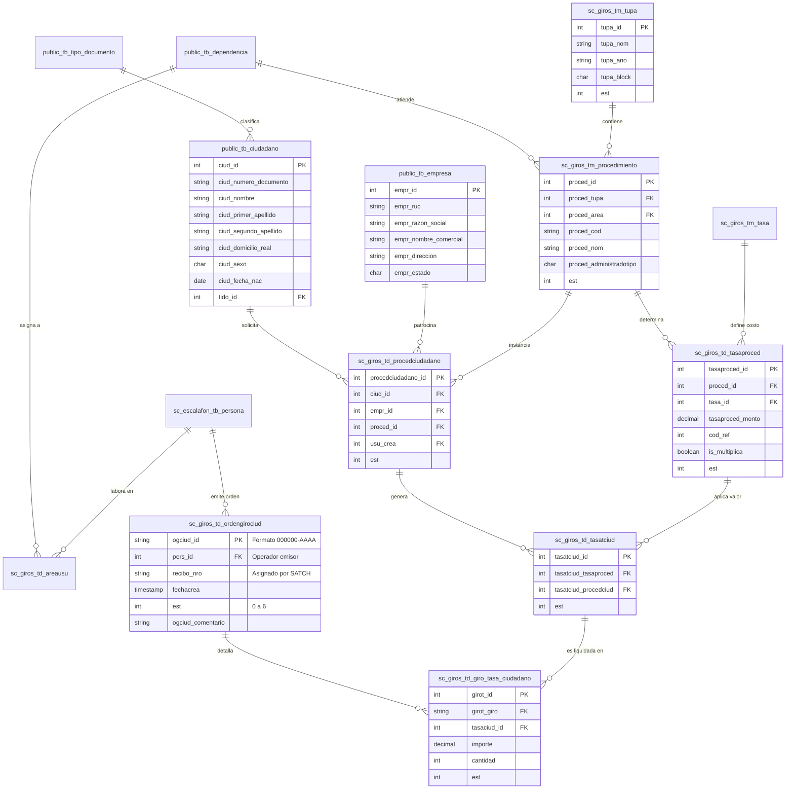

# Volumen 3: Estructura de la Base de Datos
**Sistema Integrado de Gestión de Órdenes de Derecho de Trámite (SIGODT)**  
**Municipalidad Provincial de Chiclayo (MPCH)**  

---

## 🗄️ 1. Descripción General del Motor y Arquitectura

El sistema implementa una base de datos relacional sobre **PostgreSQL (v12 o superior)** con el nombre de base de datos **`db_simcix`**.

Lejos de tratarse de una base de datos aislada, SIGODT forma parte de un **ecosistema corporativo municipal multiesquema**. La base de datos centraliza los datos de diversos sistemas de la MPCH, comunicándose con esquemas transversales mediante relaciones de integridad y llaves foráneas:

```
db_simcix (Base de Datos Central)
 ├── sc_giros                --> Núcleo del SIGODT (Órdenes, Procedimientos, Tasas, TUPA, Sincronización)
 ├── public                  --> Maestros Institucionales (Ciudadanos, Empresas, Dependencias, Tipos de Doc.)
 ├── sc_escalafon            --> Talento Humano y Personal Municipal (Personas, Locales Municipales)
 ├── sc_seguridad            --> Control de Accesos Institucional (Sistemas, Permisos, Bitácora)
 └── sc_transito_transporte  --> Registro Vehicular Municipal (Vehículos, TIV, Flotas, Propietarios)
```

---

## 📐 2. Diagrama Entidad-Relación (Mermaid ERD)



---

## 📖 3. Diccionario de Tablas Principales

### 3.1. Núcleo Operativo: `sc_giros`

#### `sc_giros.td_ordengirociud` (Cabecera de la Orden de Giro)
Representa el documento fiscal emitido para que el administrado se apersone a cancelar su derecho de trámite.
- `ogciud_id` (`varchar`, PK): Identificador único de la orden con formato correlativo anual (ej. `013341-2026`).
- `pers_id` (`integer`, FK): ID del trabajador municipal que emitió la orden (referencia a `sc_escalafon.tb_persona`).
- `recibo_nro` (`varchar` o `integer`, Nullable): Número oficial de recibo emitido por la caja del SATCH tras el pago efectivo.
- `fechacrea` (`timestamp`): Fecha y hora exacta de emisión.
- `est` (`integer`): Estado de la orden (`0` = Anulado, `1` = Girado, `2` = Asignado, `3` = Improcedente, `4` = Pagado, `5` = Usado en SGD, `6` = Extornado).
- `ogciud_comentario` (`text`): Observaciones o justificación especial ingresada por el girador.
- `sis_upd`, `usu_sis`, `fecha_update`: Campos de auditoría interna cuando un sistema externo (SISGI / SATCH) modifica la orden.

#### `sc_giros.td_giro_tasa_ciudadano` (Detalle de Liquidación del Giro)
Tabla intermedia que relaciona una orden de giro con las tasas concretas liquidadas.
- `girot_id` (`serial`, PK): Identificador de la línea de cobro.
- `girot_giro` (`varchar`, FK): Referencia a `td_ordengirociud.ogciud_id`.
- `tasaciud_id` (`integer`, FK): Referencia a `td_tasatciud.tasatciud_id`.
- `cantidad` (`integer`): Unidades liquidadas (por defecto `1`, o más si la tasa es multiplicativa).
- `importe` (`numeric(10,2)`): Monto monetario resultante a pagar en soles (S/.).
- `est` (`integer`): Estado del cobro de la tasa en el giro.

#### `sc_giros.td_tasatciud` (Instancia de Tasa del Ciudadano)
Representa la obligación de pago generada para un trámite particular.
- `tasatciud_id` (`serial`, PK): Identificador único.
- `tasatciud_tasaproced` (`integer`, FK): Referencia a `td_tasaproced.tasaproced_id`.
- `tasatciud_procedciud` (`integer`, FK): Referencia al trámite `td_procedciudadano.procedciudadano_id`.
- `est` (`integer`): Estado individual de la tasa.

#### `sc_giros.td_procedciudadano` (Expediente / Procedimiento del Administrado)
Representa la solicitud de trámite iniciada en ventanilla antes o durante la liquidación.
- `procedciudadano_id` (`serial`, PK): Identificador único del trámite.
- `procedciudadano_cod` (`varchar`): Código generado automáticamente combinando el código del procedimiento y el ID.
- `ciud_id` (`integer`, FK): Administrado solicitante (referencia a `public.tb_ciudadano`).
- `empr_id` (`integer`, FK, Nullable): Empresa solicitante si el trámite es corporativo (`public.tb_empresa`).
- `proced_id` (`integer`, FK): Procedimiento TUPA asociado (`tm_procedimiento`).
- `usu_crea` (`integer`, FK): Usuario que inició el expediente (`sc_escalafon.tb_persona`).
- `empresa_ruc`, `empresa_razon_social`: Copia histórica (snapshot) de los datos de la empresa para preservar la validez del comprobante ante cambios fiscales futuros.
- `est` (`integer`): Estado del trámite administrativo.

#### `sc_giros.tm_procedimiento` (Catálogo de Procedimientos)
- `proced_id` (`serial`, PK): ID del procedimiento.
- `proced_tupa` (`integer`, FK): Referencia al TUPA normativo (`tm_tupa`).
- `proced_area` (`integer`, FK): Dependencia municipal responsable (`public.tb_dependencia`).
- `proced_cod` (`varchar`): Código oficial TUPA (ej. `ITSE-01`, `LF-004`).
- `proced_nom` (`varchar`): Denominación oficial del procedimiento.
- `proced_administradotipo` (`char(1)`): Tipo de solicitante (`C` = Ciudadano, `E` = Empresa, `D` = Ambos).
- `proced_tipoindvasc`: Flag de control para procedimientos de inspección o transporte.
- `est` (`integer`): `1` para activo, `0` para inactivo/baja.

#### `sc_giros.td_tasaproced` (Costos y Partidas del Procedimiento)
- `tasaproced_id` (`serial`, PK): Identificador.
- `proced_id` (`integer`, FK): Procedimiento al que pertenece.
- `tasa_id` (`integer`, FK): Concepto de tasa (`tm_tasa`).
- `tasaproced_monto` (`numeric(10,2)`): Valor monetario unitario estipulado en la ordenanza.
- `cod_ref` (`integer`): Código de 5 dígitos exigido por el SATCH para imputar el ingreso a la partida presupuestal correspondiente.
- `is_multiplica` (`boolean`): Determina si en ventanilla se multiplica por una cantidad variable (m², cantidad de vehículos, etc.).

#### `sc_giros.tm_tupa` (Instrumento Normativo TUPA)
- `tupa_id` (`serial`, PK): Identificador.
- `tupa_nom` (`varchar`): Nombre de la ordenanza o compendio (ej. *TUPA 2024 - MPCH*).
- `tupa_año` (`varchar` o `integer`): Ejercicio fiscal de vigencia.
- `tupa_block` (`char(1)`): `'1'` si está bloqueado contra modificaciones, `'0'` editable.
- `est` (`integer`): `2` para el TUPA vigente activo, `1` para versiones archivadas.

#### `sc_giros.tb_token_satch` (Gestión de Tokens OAuth2)
Almacena el Bearer Token emitido por el API de SATCH para evitar autenticaciones redundantes en cada petición de sincronización.
- `token_id` (`serial`, PK)
- `access_token` (`text`): Token JWT emitido por SATCH.
- `expires_in` (`integer`): Duración en segundos (típicamente 3600 u 86400).
- `token_est` (`integer`): `1` activo, `0` revocado o expirado.

---

### 3.2. Esquemas Compartidos

#### `public.tb_ciudadano`
Padrón maestro de personas naturales que interactúan con la MPCH.
- `ciud_id` (`serial`, PK)
- `tido_id` (`integer`, FK a `tb_tipo_documento`): `1` = DNI, `3` = Carnet Extranjería, `4` = CPP.
- `ciud_numero_documento` (`varchar(15)`): Número identificador.
- `ciud_nombre`, `ciud_primer_apellido`, `ciud_segundo_apellido`
- `ciud_domicilio_real`: Dirección física validada vía RENIEC o declarada.
- `ciud_foto` (`text`): Fotografía en formato data URI Base64 provista por RENIEC.
- `ciud_sexo`, `ciud_fecha_nac`
- `ciud_estado`: `'A'` Activo, `'E'` Eliminado.

#### `public.tb_empresa`
Padrón de personas jurídicas contribuyentes y administradas.
- `empr_id` (`serial`, PK)
- `empr_ruc` (`varchar(11)`): RUC validado en SUNAT.
- `empr_razon_social`, `empr_nombre_comercial`
- `empr_direccion`: Domicilio fiscal.
- `empr_categoria`: `'E'` Empresa, `'M'` Mercado, `'L'` Libre.
- `gico_id`: Giro comercial / actividad económica CIIU.

#### `public.tb_dependencia`
Estructura orgánica de la Municipalidad Provincial de Chiclayo.
- `depe_id` (`serial`, PK)
- `depe_denominacion`: Nombre del área (ej. *Gerencia de Urbanismo*).
- `depe_siglasdoc`: Siglas oficiales para emisión de documentos.
- `lomu_id` (`integer`, FK): Local municipal donde opera la oficina.

#### `sc_transito_transporte` (Submódulo Vehicular)
- `td_vehiculo`: Registro de unidades vehiculares con su `vehi_placa`, motor y año de fabricación.
- `"td_TIV"`: Tarjetas de Identificación Vehicular vinculadas al padrón municipal.
- `td_lista_propietarios`: Personas o empresas titulares de las unidades.
- `td_emprflota`: Empresas de transporte que agrupan flotas de colectivos, combis o taxis para trámites conjuntos.

---

## ⚙️ 4. Procedimientos Almacenados y Secuencias Clave

El esquema `sc_giros` delega cierta lógica de negocio y cálculo a la base de datos:

1. **`sc_giros.ordengiro_id_sequence`:** Secuencia numérica empleada para conformar la porción numérica del código `ogciud_id` (completada con ceros a la izquierda a 6 dígitos: `000001` a `999999`).
2. **`sc_giros.fn_pagar_tasa_trabajador(...)`:** Función PL/pgSQL que liquida de forma transaccional una orden de giro interna emitida para personal municipal.
3. **`sc_giros.duplicar_tupa(p_tupa_id)`:** Procedimiento almacenado que clona íntegramente toda la estructura de procedimientos, tasas y montos de un TUPA anterior hacia un nuevo ejercicio fiscal.
4. **`sc_giros.cancelar_pago_tasa(tasatciudadano_id)`:** Procedimiento para revertir el estado de una tasa en caso de anulación de orden de giro.
