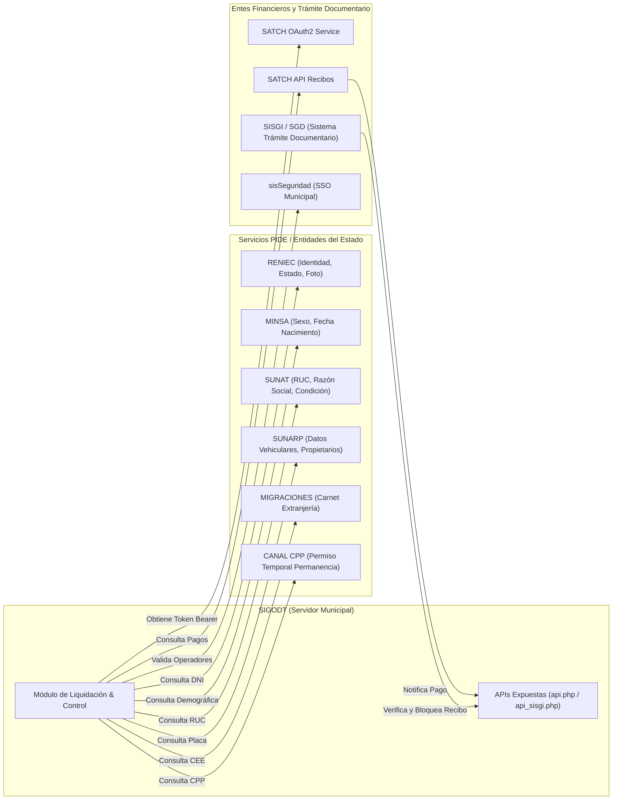

# Volumen 5: APIs Externas, Interoperabilidad y Justificación de Datos
**Sistema Integrado de Gestión de Órdenes de Derecho de Trámite (SIGODT)**  
**Municipalidad Provincial de Chiclayo (MPCH)**  

---

## 🌐 1. Catálogo Técnico de APIs Integradas en SIGODT

El sistema SIGODT no funciona como una isla de información: está conectado activamente con los servicios de la **Plataforma de Interoperabilidad del Estado Peruano (PIDE)** y con los sistemas financieros y documentarios de la propia Municipalidad Provincial de Chiclayo.

---

## 🔌 2. Detalle de Integraciones Externas e Internas

A continuación se detalla cada servicio web, su ubicación en el código, los datos que intercambia y su función específica:

### 2.1. RENIEC (Registro Nacional de Identificación y Estado Civil)
- **Implementación en Código:** [`controller/ciudadano.php`](file:///home/victorchung/PhpstormProjects/MPCH_Ordenes_Giro_SIGODT/controller/ciudadano.php#L121) y [`controller/ws_reniec.php`](file:///home/victorchung/PhpstormProjects/MPCH_Ordenes_Giro_SIGODT/controller/ws_reniec.php#L41).
- **Endpoint:** `https://www.munichiclayo.gob.pe/Pide/Reniec/{DNI}`
- **Protocolo y Método:** HTTPS POST (vía cURL con credenciales cifradas en AES-128).
- **Datos Devueltos:**
  - `nombres`, `apellido_paterno`, `apellido_materno`
  - `direccion`, `ubigeo`
  - `foto`: Fotografía del titular en formato Base64.
  - `restriccion`: Estado registral del documento (`VIGENTE`, `CANCELADO`, `FALLECIMIENTO`).
- **Función en el Sistema:**  
  Autocompleta los datos del ciudadano y **bloquea inmediatamente la emisión de órdenes de giro si el DNI pertenece a una persona fallecida o con documento cancelado**, impidiendo fraudes administrativos.

---

### 2.2. MINSA (Ministerio de Salud)
- **Implementación en Código:** [`controller/ciudadano.php`](file:///home/victorchung/PhpstormProjects/MPCH_Ordenes_Giro_SIGODT/controller/ciudadano.php#L156).
- **Endpoint:** `https://www.munichiclayo.gob.pe/Pide/Minsa/{DNI}`
- **Protocolo y Método:** HTTPS POST.
- **Datos Devueltos:**
  - `sexo`: Género biológico registrado (`M` / `F`).
  - `fecnac`: Fecha de nacimiento (`AAAA-MM-DD`).
- **Función en el Sistema:**  
  RENIEC a través de ciertos convenios no expone directamente la fecha de nacimiento en el nodo general para optimizar ancho de banda. SIGODT recurre al servicio MINSA para calcular la edad exacta del solicitante, validando si se trata de un menor de edad o si cumple los requisitos etarios exigidos por ordenanza (ej. edad mínima para licencias o permisos comerciales).

---

### 2.3. SUNAT (Superintendencia Nacional de Aduanas y Administración Tributaria)
- **Implementación en Código:** [`controller/empresa.php`](file:///home/victorchung/PhpstormProjects/MPCH_Ordenes_Giro_SIGODT/controller/empresa.php#L51).
- **Endpoint:** `https://www.munichiclayo.gob.pe/Pide/Sunat/{RUC}`
- **Protocolo y Método:** HTTPS POST.
- **Datos Devueltos:**
  - `ruc`: Número de RUC de 11 dígitos.
  - `raz_social`: Razón social de la persona jurídica o natural con negocio.
  - `nom_comercial`: Nombre comercial registrado.
  - `domicilio`: Domicilio fiscal georreferenciado.
  - `estado_ruc`: `ACTIVO`, `SUSPENSION TEMPORAL`, `BAJA`.
  - `condicion`: `HABIDO` o `NO HABIDO`.
  - `ciiu`: Actividad económica principal según el clasificador internacional.
- **Función en el Sistema:**  
  Al ingresar el RUC en ventanilla, se garantiza que la orden de giro se emita con el nombre legal y domicilio tributario exacto. Si la empresa figura en condición de "Baja" o "No Habido", el sistema alerta al operador para que se subsane la situación tributaria antes de liquidar el trámite.

---

### 2.4. SUNARP (Superintendencia Nacional de los Registros Públicos)
- **Implementación en Código:** [`controller/vehiculo.php`](file:///home/victorchung/PhpstormProjects/MPCH_Ordenes_Giro_SIGODT/controller/vehiculo.php#L124).
- **Endpoint:** `https://www.munichiclayo.gob.pe/BE_DBCIMCIX/apiPide/sunarp/{PLACA}`
- **Protocolo y Método:** HTTPS GET.
- **Datos Devueltos:**
  - `placa`, `serie`, `vin`, `nro_motor`
  - `marca`, `modelo`, `color`, `anoFabricacion`
  - `carroceria`, `codCategoria` (M1, M2, L5, etc.)
  - `propietarios`: Lista de titulares registrales.
- **Función en el Sistema:**  
  Indispensable para la Subgerencia de Transporte y Tránsito. Al emitir giros por derechos de inspección técnica vehicular, sustitución de unidad, duplicado de tarjeta de operatividad o habilitación vehicular, el sistema verifica que los números de serie y motor coincidan con la partida registral y que el solicitante sea el propietario o apoderado legítimo.

---

### 2.5. MIGRACIONES y Canal CPP (Extranjería)
- **Implementación en Código:** [`controller/ciudadano.php`](file:///home/victorchung/PhpstormProjects/MPCH_Ordenes_Giro_SIGODT/controller/ciudadano.php#L324-L413).
- **Endpoints:**
  - Carnet de Extranjería: `https://www.munichiclayo.gob.pe/Pide/Migraciones/{CARNET}`
  - CPP: `https://www.munichiclayo.gob.pe/BE_DBCIMCIX/apiPide/cpp/v2/{CPP}`
- **Datos Devueltos:** Nombres, apellidos, nacionalidad y vigencia.
- **Función en el Sistema:**  
  Garantiza el derecho de trámite a ciudadanos extranjeros residentes en Chiclayo bajo las figuras migratorias reguladas por el Estado Peruano.

---

### 2.6. SATCH (Servicio de Administración Tributaria de Chiclayo)
- **Implementación en Código:** [`api/SATCH/tokenGen.php`](file:///home/victorchung/PhpstormProjects/MPCH_Ordenes_Giro_SIGODT/api/SATCH/tokenGen.php), [`api/SATCH/get_data_satch.php`](file:///home/victorchung/PhpstormProjects/MPCH_Ordenes_Giro_SIGODT/api/SATCH/get_data_satch.php) y [`api/buscar_automatizado.php`](file:///home/victorchung/PhpstormProjects/MPCH_Ordenes_Giro_SIGODT/api/buscar_automatizado.php).
- **Endpoints del SATCH:**
  - Generación de Token: `POST http://satch.gob.pe:81/api.test/oauth/token` (OAuth 2.0 con credenciales seguras).
  - Consulta de Recibo por Giro: `GET http://satch.gob.pe:81/api.test/v1/recibos/getDatosReciboPorOrdenGiro/{orden_de_giro}`
- **Función en el Sistema:**  
  Permite la sincronización bidireccional de pagos:
  1. Cuando un ciudadano paga en las ventanillas de SATCH o entidades bancarias recaudadoras, el SATCH asocia el código `ogciud_id`.
  2. SIGODT consulta la API de SATCH mediante un proceso automatizado (`buscar_automatizado.php`), detecta que la orden fue cobrada, actualiza el estado a `4 (PAGADO)` y estampa el número oficial de recibo de caja (`recibo_nro`).
  3. Si el pago fue revertido en caja, el API notifica el estado `6 (EXTORNADO)`.

---

### 2.7. API Interna SIGODT (Consumida por el Sistema de Gestión Documental - SGD / SISGI)
- **Implementación en Código:** [`api/api.php`](file:///home/victorchung/PhpstormProjects/MPCH_Ordenes_Giro_SIGODT/api/api.php) y [`api/api_sisgi.php`](file:///home/victorchung/PhpstormProjects/MPCH_Ordenes_Giro_SIGODT/api/api_sisgi.php).
- **Endpoints Expuestos por SIGODT:**
  - `GET /SIGODT/api/api_sisgi.php?doc={NUM_ORDEN}&proced_id={PROCED_ID}`: Consulta si la orden existe, si corresponde exactamente al procedimiento solicitado y si está en estado `4 (PAGADO)`.
  - `POST /SIGODT/api/api_sisgi.php`: Cuando el funcionario de Mesa de Partes genera el expediente en el SGD, envía una solicitud POST con sus credenciales institucionales. SIGODT cambia el estado de la orden de giro a `5 (USADO)`, bloqueándola de por vida contra cualquier reutilización.

---

## ⚖️ 3. ¿Por qué es Estrictamente Necesaria Toda Esta Data?

Un usuario o auditor podría preguntarse:  
*¿Por qué el sistema no le pide simplemente al ciudadano que escriba su nombre y pague un monto genérico?*  
*¿Por qué se requiere capturar DNI, RUC, domicilios, datos de SUNARP, códigos CIIU y estados del SATCH?*

La respuesta se sustenta en tres pilares: **el marco legal peruano**, **el control tributario municipal** y **la prevención del fraude administrativo**.

### 3.1. Marco Legal del Procedimiento Administrativo en el Perú

1. **TUO de la Ley Nº 27444 - Ley del Procedimiento Administrativo General (D.S. Nº 004-2019-JUS):**
   - **Principio de Presunción de Veracidad (Art. IV, 1.7):** La administración debe presumir que los administrados dicen la verdad, pero está obligada a implementar fiscalización posterior y verificación en línea con bases de datos públicas.
   - **Artículo 48º (Prohibición de solicitar documentación que el Estado ya posee):**  
     La Ley 27444 prohíbe explícitamente que una entidad pública exija a un administrado presentar fotocopias de DNI, constancias de RUC o copias literales de registros vehiculares.
     > *"Las entidades están prohibidas de solicitar a los administrados la presentación de información que obre en poder de la entidad o que pueda ser obtenida a través de la interoperabilidad (PIDE)."*
     Por lo tanto, **SIGODT está obligado por mandato legal a consumir las APIs de RENIEC, SUNAT y SUNARP** en lugar de pedir papeles al ciudadano.

2. **Decretos Legislativos de Simplificación Administrativa (D.L. Nº 1246 y D.L. Nº 1310):**
   - Imponen el uso obligatorio de la **Plataforma de Interoperabilidad del Estado Peruano (PIDE)** administrada por la PCM. La Municipalidad de Chiclayo cumple estas directivas nacionales al integrar el sistema directamente a dichos canales.

---

### 3.2. Razones de Gestión Tributaria y Financiera (SATCH y MEF)

1. **Destino Presupuestal y Clasificador de Ingresos (Partida `cod_ref`):**
   - En el sector público, el dinero recaudado no entra a un fondo ciego común. Cada tasa municipal corresponde a una partida presupuestal aprobada por el Ministerio de Economía y Finanzas (MEF).
   - El código `cod_ref` de 5 dígitos garantiza que cuando el ciudadano paga en el SATCH, el dinero se acredite contablemente a la gerencia municipal correspondiente (ejemplo: fondo para mantenimiento de vías de transporte vs. fondo para áreas verdes y parques).
2. **Separación de Funciones Administrativas y Recaudatorias:**
   - Por mandato de la Ley Orgánica de Municipalidades (Ley Nº 27972), el personal administrativo de una gerencia (Urbanismo, Transporte, Salud) **no puede tocar dinero en efectivo en ventanilla** para evitar actos de corrupción.
   - La recaudación está delegada por ordenanza en el **SATCH**. La data que intercambia SIGODT con el SATCH es el único puente que garantiza que nadie liquide montos arbitrarios ni reciba cobros indebidos.

---

### 3.3. Prevención de Fraude, Suplantación y Fuga de Fondos

La captura de la data detallada responde a riesgos concretos que históricamente afectaron la recaudación municipal:

| Riesgo / Modalidad de Fraude | Cómo lo Previene la Data Recolectada por SIGODT |
| :--- | :--- |
| **Suplantación de Identidad** | La consulta a RENIEC y la captura de la fotografía oficial impiden que personas inescrupulosas tramiten autorizaciones o licencias a nombre de terceros sin poder legal. |
| **Trámites con Sujetos Fallecidos** | El campo `restriccion = 'FALLECIMIENTO'` de la API de RENIEC frena automáticamente cualquier intento de transferir propiedades o licencias a nombre de titulares que ya no están con vida. |
| **Reutilización de Comprobantes ("El Doble Recibo")** | Antes de este sistema, un administrado pagaba un recibo de S/. 50.00 en caja y le sacaba fotocopia para meter dos expedientes en gerencias distintas. Con SIGODT y la API `api_sisgi.php`, una vez que el SGD procesa la orden, pasa inmediatamente a estado **`5 (USADO)`**, bloqueando cualquier segundo uso. |
| **Cobro de Tasas Incorrectas o Adulteradas** | Al estar amarrado al TUPA (`tm_tupa`), el operador no puede digitar montos inventados en el teclado: el sistema calcula la liquidación oficial basada en la ordenanza vigente. |
| **Uso de Empresas Fantasma** | La consulta a SUNAT verifica en tiempo real que el RUC esté "Activo" y en condición "Habido", impidiendo otorgar licencias municipales a empresas clausuradas o con domicilio falso. |
| **Vehículos con Placas Clonadas o Robadas** | La verificación cruzada de `nro_motor` y `serie (VIN)` contra la base de datos de SUNARP garantiza que la unidad que se habilita para servicio público es legítima y coincide con los registros registrales de propiedad. |
