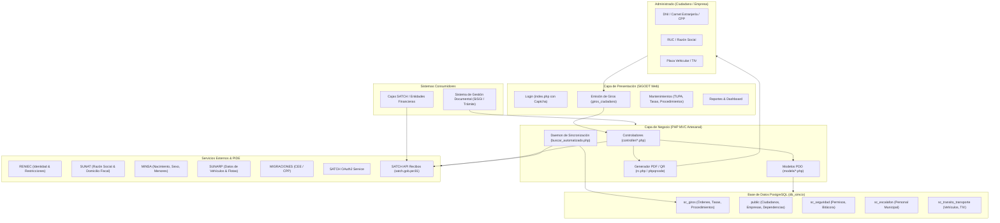

# Documentación Técnica Integral: Sistema SIGODT - MPCH
**Sistema Integrado de Gestión de Órdenes de Derecho de Trámite**  
**Entidad:** Municipalidad Provincial de Chiclayo (MPCH)  
**Ubicación de Análisis:** Repositorio `MPCH_Ordenes_Giro_SIGODT`  
**Fecha de Análisis:** Septiembre 2026  

---

## 📌 1. Resumen Ejecutivo

El presente dossier de documentación constituye una auditoría y análisis exhaustivo de cada uno de los componentes que integran el software **SIGODT** (Sistema Integrado de Gestión de Órdenes de Derecho de Trámite). Este sistema fue desarrollado con el objetivo primordial de gobernar, automatizar y fiscalizar el ciclo de vida de las **Órdenes de Giro** vinculadas a las tasas y tributos del Texto Único de Procedimientos Administrativos (**TUPA**) y trámites institucionales de la Municipalidad Provincial de Chiclayo.

El proyecto actúa como una bisagra crítica entre:
1. **El Administrado (Ciudadano o Empresa):** Que solicita un trámite o servicio municipal.
2. **Las Dependencias y Áreas Municipales:** Que evalúan, generan y validan las tasas administrativas (Urbanismo, Tránsito y Transporte, Licencias, etc.).
3. **Las Plataformas de Identidad y Registro del Estado Peruano (PIDE):** RENIEC, SUNAT, SUNARP, Migraciones y MINSA.
4. **El Ente Recaudador Externo (SATCH):** El Servicio de Administración Tributaria de Chiclayo, donde se realiza la cobranza efectiva.
5. **El Sistema de Trámite Documentario (SISGI / SGD):** Que procesa el expediente final solo si la orden de giro se encuentra debidamente pagada.

---

## 🗂️ 2. Estructura de la Documentación en `agentai/`

Para garantizar un estudio ordenado, modular y de fácil lectura para el equipo de desarrollo, auditores y tomadores de decisiones, la información se ha desglosado en cinco volúmenes especializados:

| Documento | Enlace | Descripción y Contenido Clave |
| :--- | :--- | :--- |
| **Volumen 1: Arquitectura y Flujo de Negocio** | [`01_funcionalidad_y_flujo_negocio.md`](file:///home/victorchung/PhpstormProjects/MPCH_Ordenes_Giro_SIGODT/agentai/01_funcionalidad_y_flujo_negocio.md) | Qué hace el sistema, flujo funcional paso a paso, ciclo de vida de una orden, máquina de estados (0 a 6), tipos de administrados y roles operativos. |
| **Volumen 2: Evaluación Técnica y Calidad** | [`02_evaluacion_tecnica_y_calidad.md`](file:///home/victorchung/PhpstormProjects/MPCH_Ordenes_Giro_SIGODT/agentai/02_evaluacion_tecnica_y_calidad.md) | Veredicto "Qué tan bueno es", calificación técnica global, fortalezas, fallas críticas de seguridad, credenciales expuestas, condiciones de carrera y plan de refactorización. |
| **Volumen 3: Base de Datos** | [`03_base_de_datos.md`](file:///home/victorchung/PhpstormProjects/MPCH_Ordenes_Giro_SIGODT/agentai/03_base_de_datos.md) | Motor PostgreSQL (`db_simcix`), análisis multiesquema (`sc_giros`, `public`, `sc_escalafon`, `sc_seguridad`, `sc_transito_transporte`), ERD en Mermaid, secuencias y procedimientos almacenados. |
| **Volumen 4: Vistas y Frontend** | [`04_vistas_y_frontend.md`](file:///home/victorchung/PhpstormProjects/MPCH_Ordenes_Giro_SIGODT/agentai/04_vistas_y_frontend.md) | Stack UI (Tabler, Bootstrap 5, DataTables), catálogo de todas las vistas (`view/`), modales, scripts JS asíncronos y generación de comprobantes PDF/QR. |
| **Volumen 5: APIs Externas e Interoperabilidad** | [`05_apis_externas_e_interoperabilidad.md`](file:///home/victorchung/PhpstormProjects/MPCH_Ordenes_Giro_SIGODT/agentai/05_apis_externas_e_interoperabilidad.md) | Detalle de endpoints PIDE (RENIEC, SUNAT, SUNARP, MINSA, CEE, CPP), integración OAuth SATCH, APIs internas (`api.php`, `api_sisgi.php`) y justificación legal de la data requerida. |

---

## 💻 3. Ficha Técnica General del Proyecto

```yaml
Nombre del Proyecto: MPCH_Ordenes_Giro_SIGODT
Lenguaje de Backend: PHP (Versiones 7.4 - 8.2)
Arquitectura de Código: MVC artesanal sin framework (Procedural + Clases PDO orientadas a acciones vía switch)
Gestor de Base de Datos: PostgreSQL 12+ (Base de datos: db_simcix)
Esquemas BD: sc_giros, public, sc_escalafon, sc_seguridad, sc_transito_transporte
Diseño Visual / UI: Tabler Admin Template v1.0 (Bootstrap 5)
Librerías Frontend: jQuery 3.6.0, DataTables 1.13.4, SweetAlert2 v11, Toastr, Select2
Librerías de Generación de Documentos: FPDF 1.84, phpqrcode (generación local de tickets térmicos 117mm con QR)
Mecanismo de Autenticación: Delegado a microservicio interno (sisSeguridad / SOAP-REST sobre PostgreSQL)
Interoperabilidad: PIDE (Plataforma de Interoperabilidad del Estado Peruano) y OAuth 2.0 (SATCH)
Procesos en Segundo Plano: Scripts CLI / Web cron con Advisory Locks PostgreSQL
```

---

## 🗺️ 4. Mapa Conceptual del Ecosistema SIGODT



---

## ⚖️ 5. Principales Hallazgos del Diagnóstico

1. **Cumplimiento Funcional:** El sistema cubre integralmente la problemática de ordenamiento tributario-administrativo local, resolviendo un flujo histórico de descontrol entre la emisión de órdenes de trámite y el cobro en caja.
2. **Capacidad de Interoperabilidad:** Es destacable la conexión con las bases de datos de la administración pública (RENIEC, SUNAT, SUNARP, Migraciones), lo que garantiza la aplicación del principio de presunción de veracidad y la simplificación administrativa (D.L. 1246).
3. **Deuda Técnica Crítica:** La ausencia de un framework moderno (como Laravel o Symfony), la presencia de credenciales quemadas en el código fuente, la manipulación de DDL (`ALTER SEQUENCE`) en tiempo de ejecución y la falta de transaccionalidad segura en la bitácora representan vulnerabilidades severas que requieren atención prioritaria antes de cualquier ampliación funcional.

> [!NOTE]
> Para profundizar en el análisis de cada apartado, remítase a los documentos individuales listados en la tabla del apartado 2.
